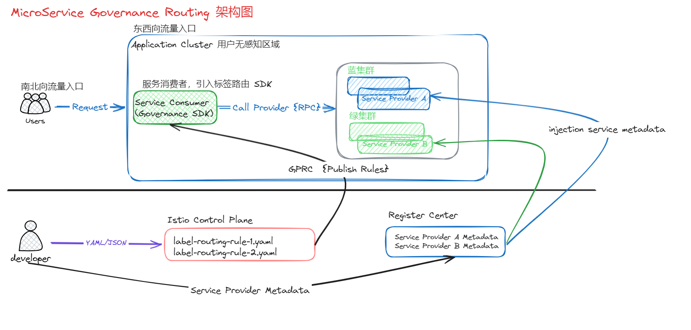

# 基于 cloud native 的微服务治理-标签路由能力

## integrated-example

mvn clean install -Dmaven.test.skip=true

istio 部署跳过，环境资源受限，使用 控制器 接口模拟规则推入

## Docker 部署测试

参考 `governance-routing-docker/src/main/README.md`

## 架构图

